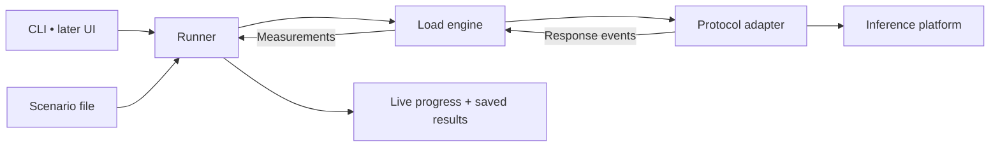

# loadgen

```mermaid
flowchart LR
    A["CLI • later UI"] --> B["Runner"]
    S["Scenario file"] --> B
    B --> C["Load engine"]
    C --> D["Protocol adapter"]
    D --> E["Inference platform"]
    D -->|Response events| C
    C -->|Measurements| B
    B --> R["Live progress + saved results"]
```