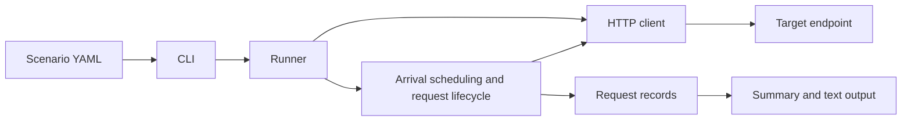

# loadgen

A Python CLI for generating HTTP load against inference endpoints and other HTTP services. Define a traffic pattern in YAML, run it against an endpoint, and inspect throughput, latency, scheduling delay, and failures.

The current version measures complete HTTP requests. LLM streaming metrics such as time to first token, inter-token latency, and token throughput are not implemented yet.

## Features

- Constant, linear ramp, and Gaussian burst rate curves.
- Optional gamma-distributed arrival gaps with a reproducible seed.
- Asynchronous HTTP requests with connection reuse.
- A maximum number of in-flight requests and per-request deadlines.
- Periodic progress on stderr and a final summary on stdout.
- Partial results when interrupted with Ctrl+C.

## Quick start

Requires Python 3.11 or newer. From the repository root:

```bash
python3 -m venv .venv
source .venv/bin/activate
python -m pip install -e .
```

Start a local test server in another terminal:

```bash
python3 -m http.server 8000 --bind 127.0.0.1
```

Run the baseline scenario:

```bash
loadgen run configs/scenarios/baseline.yaml
```

This sends a scheduled 2 requests per second for 10 seconds. The local server is a smoke test for the generator; it does not measure inference performance.

For a burst with irregular arrivals:

```bash
loadgen run configs/scenarios/bursty-gamma.yaml
```

Use `loadgen --help` or `loadgen run --help` for command help. Configuration paths are relative to your current working directory; absolute paths also work.

## Configuration

A scenario describes the target, the request, and the arrival schedule:

```yaml
target:
  url: "http://127.0.0.1:8000/"
  method: "GET"

request:
  headers:
    Accept: "text/html"

load:
  pattern: "burst"
  duration_seconds: 60
  requests_per_second: 10.0
  peak_rps: 100.0
  center_seconds: 30.0
  width_seconds: 3.0
  max_in_flight: 200
  timeout: 10.0

arrival_distribution:
  shape: 0.7
  seed: 42
```

This models a 10 RPS baseline that rises smoothly to 100 RPS at 30 seconds and returns to baseline. `width_seconds` is the Gaussian standard deviation; most of the additional traffic occurs within six seconds of the peak.

### Rate curves

Every load pattern requires `duration_seconds`, `requests_per_second`, `max_in_flight`, and `timeout`. Times are in seconds.

| Pattern | Meaning of `requests_per_second` | Additional fields |
| --- | --- | --- |
| `constant` | Fixed rate | None |
| `ramp` | Starting rate | `slope`: change in RPS per second |
| `burst` | Baseline rate | `peak_rps`, `center_seconds`, `width_seconds` |

For example, this ramp starts at 5 RPS and reaches 35 RPS at the end of the load window:

```yaml
load:
  pattern: "ramp"
  duration_seconds: 60
  requests_per_second: 5.0
  slope: 0.5
  max_in_flight: 100
  timeout: 10.0
```

Replace the `load` section of a complete scenario with this block. The rate must remain nonnegative throughout the run. For a surge, set `peak_rps` above the baseline; it is the total peak rate, not an amount added to the baseline. Pattern-specific fields are validated: `slope`, for example, belongs only to `ramp`.

### Arrival gaps

The rate curve controls how traffic intensity changes over time. `arrival_distribution` controls the spacing of individual arrivals within that curve.

Omit `arrival_distribution` for deterministic arrivals. Include it for gamma gaps:

| Shape | Arrival behavior |
| --- | --- |
| Less than 1 | More variable gaps, producing clusters and pauses |
| 1 | Exponential gaps; Poisson arrivals under a constant rate |
| Greater than 1 | More regular spacing |

Gamma gaps are sampled in cumulative request-volume space with mean 1, then mapped to timestamps using the inverse cumulative rate. A fixed seed reproduces the planned schedule; actual dispatch timing still depends on the machine. Rates describe the intended traffic intensity, not a strict count in every one-second interval.

### HTTP payloads

The same configured request is used for every arrival. Set `request.json` to send a JSON body. For example, against a compatible inference server, replace the target and request sections with:

```yaml
target:
  url: "http://127.0.0.1:8000/v1/chat/completions"
  method: "POST"

request:
  headers:
    Content-Type: "application/json"
  json:
    model: "your-served-model"
    messages:
      - role: "user"
        content: "Explain connection pooling in one paragraph."
    max_tokens: 128
    stream: false
```

Use the model name and request schema supported by your server. This measures HTTP completion time, not response quality.

## Scheduling and overload

Scheduling is open-loop: arrivals are planned independently of response completion. The engine creates concurrent request tasks as their scheduled times arrive.

When `max_in_flight` is reached, an arrival is recorded as **skipped**, rather than queued for a later request slot. This limit applies to request tasks; the HTTP client's connection pool has its own limits. A started task does not prove that its request has reached the server.

The engine observes the full configured load window, then waits for remaining requests to finish. `timeout` bounds each dispatched request, including time spent waiting inside the client. HTTPX's own default timeouts also apply and can fail a request earlier. Total elapsed time includes this final drain.

Press Ctrl+C to cancel the run and print a partial summary. The CLI exits with code 130 for a cancelled run.

## Reading the summary

| Metric | Meaning |
| --- | --- |
| Recorded arrivals | Request records created during the run, including skipped arrivals |
| Started | Requests whose execution began |
| Successful | Requests completed with a successful HTTP status |
| Failed | HTTP status errors, transport errors, or request deadlines |
| Skipped | Arrivals dropped because the in-flight limit was reached |
| Cancelled | Requests cancelled during execution or before they started |
| Success / started | Successful requests divided by started requests |
| Successes / total elapsed | Successful requests per second, including drain time |
| Success latency | Time from dispatch to completion for successful requests only |
| Scheduler lag | Time from planned arrival to actual dispatch for started requests |

Timing summaries include mean, p50, p95, p99, and maximum values in milliseconds. `N/A` means there are no applicable samples. Failure reasons are grouped by category, such as `ConnectError`, `HTTPStatusError`, or `request_deadline`.

Progress is printed approximately every five seconds. To save the final text summary while keeping progress visible:

```bash
loadgen run configs/scenarios/baseline.yaml > summary.txt
```

Configured RPS is offered load, not guaranteed server throughput. Rising scheduler lag or skipped arrivals can indicate generator-side limits. Compare results with server-side telemetry to understand what traffic actually arrived. Running the generator and server on the same machine also makes them compete for resources.

## Architecture



| Module | Responsibility |
| --- | --- |
| `config.py` | YAML loading and configuration validation |
| `cli.py` | Command-line entry point |
| `runner.py` | Client lifecycle and run orchestration |
| `engine.py` | Rate curves, arrival generation, scheduling, and execution |
| `client.py` | HTTP request construction and transport |
| `models.py` | Request records, run results, and summary types |
| `output.py` | Metric aggregation and formatted output |

The current implementation runs in one process, keeps request records in memory, and uses numerical integration to construct arrival schedules. Very long runs, very high rates, and narrow rate-curve features need additional care. Distributed generation, streamed token measurements, and structured result export are future extensions.

## Development

Install the optional development dependencies:

```bash
python -m pip install -e '.[dev]'
```

## License

[MIT](LICENSE)
